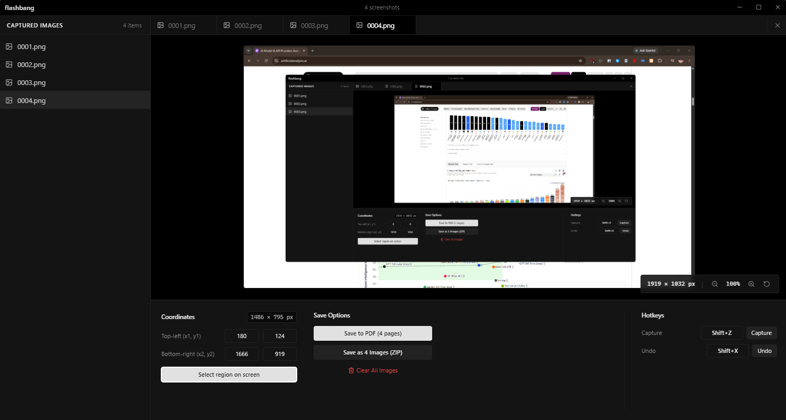

<p align="center">
  
</p>

# Flashbang

I made Flashbang because pressing `Windows + Shift + S` constantly is tedious when taking notes. When the target screen area doesn't change, there's no point in manually dragging a bounding box over and over again. I needed an instant way to capture specific coordinates with a single keystroke and compile the whole queue directly into a PDF — ergo, Flashbang.



---

## Features

- **Fixed-Coordinate Capture**: Set your coordinates once (or use the screen selection overlay) and press `Shift+Z` globally from any window.
- **Global Undo**: Press `Shift+X` globally to delete the last taken screenshot if you made a mistake.
- **VS Code Tabbed Interface**: Preview captured images in tabs, zoom/pan, and reorder screenshots via the left sidebar.
- **Export to PDF or ZIP**: Export the entire sequenced queue to an exact 1:1 pixel PDF document or compress into a numbered ZIP archive.
- **Temporary by Default**: All screenshots live in a temporary session directory and are automatically purged when the app is closed or cleared.
- **Persistent SQLite Storage**: Region coordinates and hotkey bindings are preserved across app restarts.

---

## Running the App

```bash
# Install dependencies
npm install

# Start with live reload
npm start

# Build production binaries
npm run dist
```

### Packaging & Executables

- `npm run dist` — Generates both the **Portable `.exe`** and the **Setup Installer (`.exe`)** in the `release/` directory.
- `npm run dist:portable` — Generates standalone single-file `Flashbang 1.0.0.exe`.